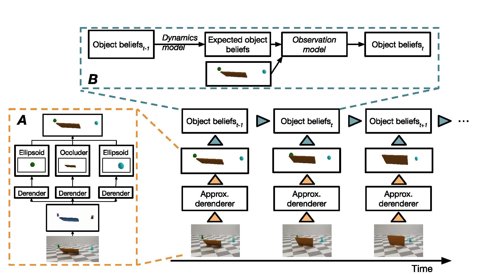

# ADEPT-Model-Release
PyTorch implementation of Approximate Derenderer, Extended Physics, and Tracking (ADEPT).



Modeling Expectation Violation in Intuitive Physics with Coarse Probabilistic Object Representations

Kevin Smith*, Lingjie Mei*, Shunyu Yao, Jiajun Wu, Elizabeth S. Spelke, Joshua B. Tenenbaum, Tomer Ullman  (* indicates equal contribution)

Preprint

[Paper](http://physadept.csail.mit.edu/papers/adept.pdf) [BibTeX](http://physadept.csail.mit.edu/bibtex/adept.bib) [Website](http://physadept.csail.mit.edu/)

For data preparation, see our [dataset generation repository](https://github.com/JerryLingjieMei/ADEPT-Dataset-Release) for dataset generation.

## Getting started
### Prerequisites
+ Linux
+ Python3
+ PyTorch 1.1 with CUDA support
+ Other required python packages specified by `requirements.txt`.
### Installation
1. Clone this repository

    ```bash
    git clone https://github.com/JerryLingjieMei/ADEPT-Model-Release
    cd ADEPT-Model-Release
    ```
    and change `CONTENT_FOLDER` in `utils.constants` to the folder of this repository.

1. Create a conda environment for ADEPT Model and install the requirements. 
    
    ```bash
    conda create --n adept-model
    conda activate adept-model
    pip install -r requirements.txt
    conda install pytorch=1.1.0 cuda100 -c pytorch #Assume you use cuda version 10.0
    ```
 
1. Set up Mask R-CNN implementation by Facebook Research, see [here](https://github.com/facebookresearch/maskrcnn-benchmark)

1. Change `TRAIN_ROOT` and `HUMAN_ROOT` in `tools/paths_catalog.py` to reflect the directory storing training videos 
and human test videos, and `ANNOTATION_FOLDER` in `experiments/default_physics.yaml` to the directory storing human test videos.

1. Download pretrained weights for detection and derender by running

    ```bash
    . scripts/download_pretrained_model.sh
    ```

1. (Optional) If you have multiple machines, you may change `get_host_id` in `utils/misc.py` 
to reflect the id of your machine. With that in hand, you may speed up physical reasoning process
 by using `--stride N` arguments, where you have `N` machines with consecutive ids.

### Experiments

1. Collect COCO annotations for the training set,

    ```bash
    # Fill in the TRAIN_SET_FOLDER with the training set folder
    python3 dataset/makers/make_coco.py -i ${TRAIN_SET_FOLDER} -o data/ann.json
    ```
    
    Then train the detection part of perception on the training set and test on training set and human test set,
    
    ```bash
   # Training and testing with multiple GPUs
    export CUDA_VISIBLE_DEVICES=0,1,2,3
    export NGPUS=4
    python -m torch.distributed.launch --nproc_per_node=$NGPUS tools/detection_train_net.py --config_file experiments/default_detection.yaml
    python -m torch.distributed.launch --nproc_per_node=$NGPUS tools/detection_test_net.py --config_file experiments/default_detection.yaml
    # Training and testing on a single GPU
    python tools/detection_train_net.py --config_file experiments/default_detection.yaml
    python tools/detection_test_net.py --config_file experiments/default_detection.yaml
    ```
    
1. Collect Object Proposal annotations for the training set and train the approximate derenderer part of the perception.
    
    ```bash
    # Fill in the TRAIN_SET_FOLDER with the training set folder
    python3 dataset/makers/make_proposal.py -i ${TRAIN_SET_FOLDER} -o data/annotated_ann.json
    python3 tools/train_net.py --config_file experiments/default_derender.yaml
    ```
    
    Collect Object Proposal annotations for the human test set and test the approximate derender.
    
    ```bash
    # Fill in the HUMAN_TEST_SET_FOLDER with the human set folder
    python3 dataset/makers/make_proposal.py -i ${HUMAN_TEST_SET_FOLDER} -o data/annotated_ann.json
    python3 tools/test_net.py --config_file experiments/default_derender.yaml
    ```
    
1. Evaluate the physical reasoning result on the inferred objects proposals of human test set:

    ```bash
    # Single machine
    python3 tools/run_physics.py --config_file experiments/default_physics.yaml
    # Multiple (e.g. 8) machines
    python3 tools/run_physics.py --config_file experiments/default_physics.yaml --stride 8 #On each machine
    ```
